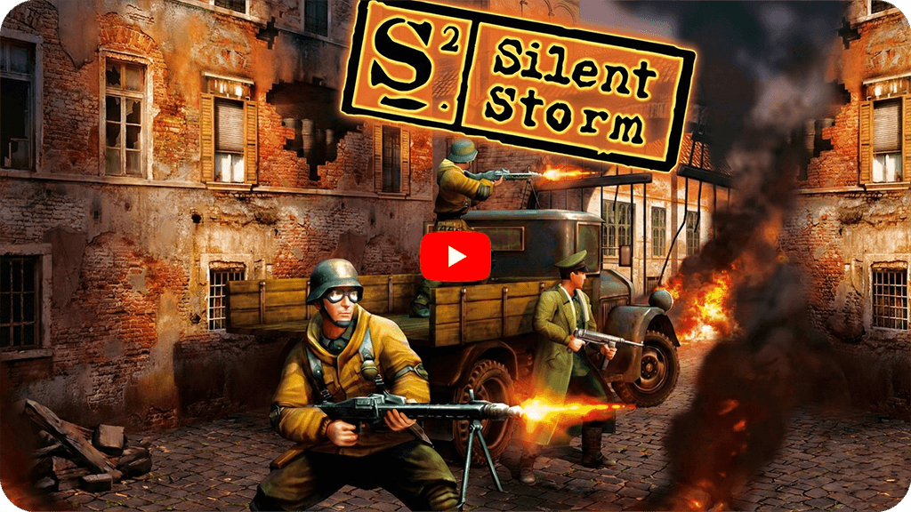

[English](README_English.md)        [Русский](README_Russian.md)        [中文](README_Chinese.md)        [हिन्दी](README_Hindi.md)        [Español](README_Spanish.md)        [Français](README_French.md)        [Deutsch](README_German.md)        [Português](README_Portuguese.md)        [日本語](README_Japanese.md)        [Bahasa Indonesia](README_Indonesian.md)

    

コンピューターゲーム [Silent Storm](https://ja.wikipedia.org/wiki/Silent_Storm) は、[Nival Interactive](http://nival.com/) が開発したターン制タクティカルRPG/ストラテジーゲームで、2003年にリリースされました。

このゲームは現在も [Steam](https://store.steampowered.com/app/254960/Silent_Storm_Gold_Edition/) と [GOG.com](https://www.gog.com/game/silent_storm_gold) で入手可能です。

ゲームのソースコードは、Nival International Ltd. の[特別ライセンス](../../LICENSE.md)の下でリリースされており、コミュニティ、教育、研究目的に完全に開放されています。使用前に[ライセンス契約](../../LICENSE.md)の条件を注意深くご確認ください。

## 技術スタック

- **エンジン**：独自の3Dエンジン、主にC++で記述
- **スクリプト言語**：Lua 4.0
- **アニメーション**：カスタムアニメーションシステム
- **ビデオ**：Bink Video Technology ⚠️ *商用ライセンス - 含まれていません*
- **サウンド**：FMOD sound system ⚠️ *商用ライセンス - 含まれていません*
- **グラフィックス**：DirectX 8

## このリポジトリの内容

- `Soft/` — ソースコードと開発ツール
- `Complete/` — ゲームデータとリソース
- `Data/` — ゲーム設定データ
- `Tools/` — 開発およびビルドツール
- `bin/` — コンパイル済み実行ファイル
- `cfg/` — 設定ファイル
- `Versions/Current` — 開発者バージョン

---

# ゲームの実行

## 基本的な起動

1. `bin/` ディレクトリに移動
2. ゲームの実行ファイル `Game.exe` を実行

デフォルトでは、ゲームは800x600の解像度でウィンドウモードで実行されます。ウィンドウモードの場合、Display Properties/Settings/Colorsの現在のモードの色深度は32ビット（トゥルーカラー）である必要があります。フルスクリーンモードで実行するには、–fullscreen パラメータを使用します。解像度を変更するには、640x480、1024x768、1280x1024の解像度にそれぞれ対応する –640、-1024、-1280 パラメータを使用します。

⚠️ 最新のオペレーティングシステムでの実行には問題があります。解決策を見つけた場合は、GitHub Issues を通じてお知らせください。

---

# マップエディタと開発ツール

## マップエディタ

- **場所**：`bin/MapEdit.exe`

---

# プロジェクトのビルド

## ビルド要件

- Microsoft Visual Studio .NET 2003
- DirectX 8.1 SDK

---

## ライセンス情報

このプロジェクトは、NIVAL INTERNATIONAL LTD の**特別な非商用ライセンス**の下でリリースされています。

### ⚠️ ソースコードに含まれていない追加ツール：

- **FMOD Audio System**
- **Bink Video Technology**

### 📋 サードパーティコンポーネントのライセンス：

- **STLport** - BSD類似ライセンス
- **zlib** - zlibライセンス
- **Lua 4.0** - MIT類似ライセンス
- **Ogg Vorbis** - BSD類似ライセンス

このコードを使用する前に、完全な[ライセンス契約](../../LICENSE.md)を注意深くご確認ください。

---

# 追加情報

## プロジェクトの状態

これは2003年の**歴史的なソースコードリリース**です。コードは教育目的、保存、および潜在的なコミュニティ開発のために現状のまま提供されています。

| コンポーネント                    | 注記                         |
|-----------------------------------|------------------------------|
| オリジナルビルド (VS .NET 2003)   | オリジナルツールが必要       |
| プロプライエタリ依存関係を削除    | FMOD、Binkは置き換えが必要   |

## 著者

**オリジナル開発**：Nival Interactive (2001-2003)

## サポート

- **問題**：GitHub Issues を使用
- **改善**：修正や新機能を提案したい場合は、プルリクエストを作成してください
- **コミュニティ**：ゲームコミュニティのオーナーまたはアクティブな参加者で、プロジェクトの開発に興味がある場合は、karim.kimsanbaev@gmail.com までメールをお送りください。

---

> **注意**：これは歴史的なソースコードリリースです。ゲームは現在も商業的に入手可能です。ゲームを楽しんだ場合は、オリジナルのパブリッシャーをサポートしてください。

**Silent Storm&trade;** はその所有者の商標です。このリポジトリは教育および保存目的のみです。

